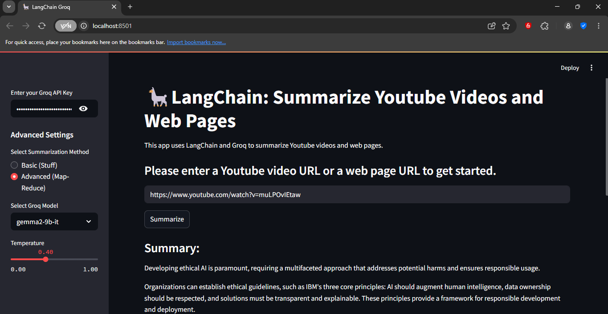

# 🦙 LangChain-Groq Summarizer

A simple yet powerful Streamlit web app that summarizes **YouTube videos** and **web pages** using **LangChain** and **Groq LLMs**. Built for speed, simplicity, and flexibility.

## 🚀 Features

- 📺 Summarize YouTube video transcripts automatically.
- 🌐 Summarize public web pages (e.g., Wikipedia, blogs, articles).
- 🧠 Choose between:
  - **Basic Summarization (Stuff)** – quick, single-pass summary.
  - **Advanced Summarization (Map-Reduce)** – better for longer content.
- 🤖 Select Groq LLMs like `gemma2-9b-it`, `llama-3.1-8b-instant`, etc.
- 🔥 Control creativity with a temperature slider.
- 📊 Shows summary length and document statistics.
- 🎈 Intuitive and interactive UI with Streamlit.

## 📸 Demo

> The app takes a URL and produces a clean, concise summary using LLMs.

## 🛠️ Tech Stack

- **LangChain** – for prompt templating, chaining, and document loading.
- **Groq API** – LLM inference via high-speed transformer models.
- **Streamlit** – UI framework for rapid prototyping.
- **FAISS** (included but not yet active) – scalable vector search (for future extensions).
- **Python 3.9+**

## 🔑 Prerequisites

- Python 3.9 or higher
- A valid [Groq API key](https://console.groq.com/)

## 📦 Installation

1. **Clone the repository:**

   git clone https://github.com/your-username/langchain-groq-summarizer.git
   cd langchain-groq-summarizer

2. **Create a virtual environment (recommended):**

python -m venv venv
source venv/bin/activate  # On Windows: venv\Scripts\activate

3. **Install the dependencies:**

pip install -r requirements.txt

4.**Run the app:**

streamlit run app.py

**🔍 Usage**
1.Enter your Groq API key in the sidebar.

2.Choose summarization method (Basic or Advanced).

3.Select a model and temperature.

4.Paste a YouTube video URL or web page URL.

5.Click Summarize.

6.🎉 Get your concise summary!

**📁 Project Structure**

├── app.py                 # Main Streamlit app
├── requirements.txt       # Python dependencies
├── README.md              # Project documentation
└── assets/
    └── screenshot.png     # App screenshot

**📌 To-Do (Optional Extensions)**

 1.Add FAISS-based document memory.

 2.Upload PDF/docx content.

 3.Save and export summaries.

 4.Integrate other LLM providers.

